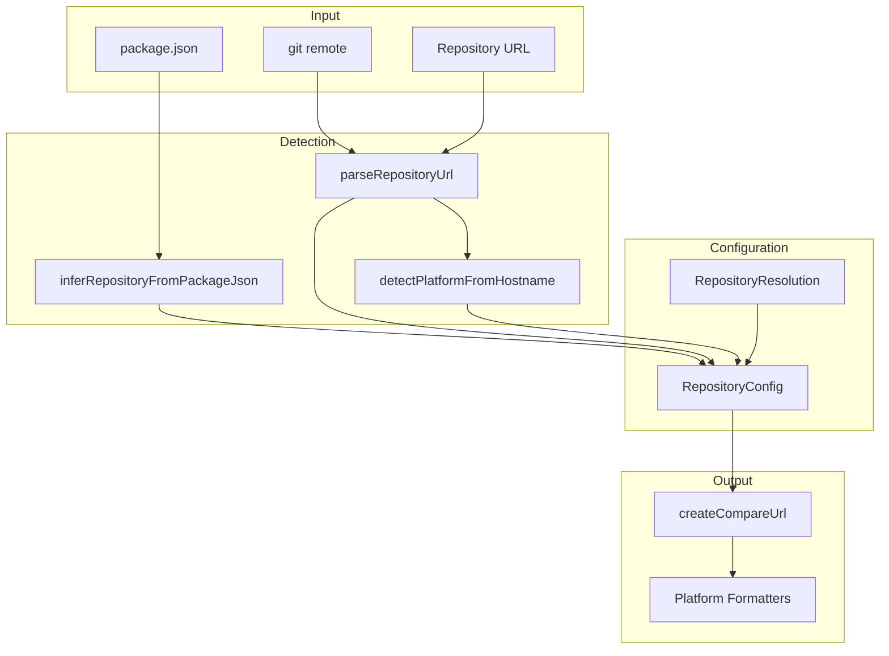

# repository/

Repository detection and compare URL generation for changelog entries.

## Overview

This module handles repository configuration for generating compare URLs in changelog entries. It supports automatic detection from package.json or git remotes, with built-in formatters for GitHub, GitLab, Bitbucket, and Azure DevOps.



## Supported Platforms

| Platform     | Compare URL Format                                       |
| ------------ | -------------------------------------------------------- |
| GitHub       | `{baseUrl}/compare/{fromCommit}...{toCommit}`            |
| GitLab       | `{baseUrl}/-/compare/{fromCommit}...{toCommit}`          |
| Bitbucket    | `{baseUrl}/compare/{toCommit}..{fromCommit}` (reversed)  |
| Azure DevOps | `{baseUrl}?version=GT{toCommit}&compareVersion=GT{from}` |

## Usage Examples

### Parse Repository URL

```typescript
import { parseRepositoryUrl } from '@hyperfrontend/versioning/repository/parse'

// HTTPS URLs
parseRepositoryUrl('https://github.com/owner/repo')
// → { platform: 'github', baseUrl: 'https://github.com/owner/repo' }

// SSH URLs
parseRepositoryUrl('git@github.com:owner/repo.git')
// → { platform: 'github', baseUrl: 'https://github.com/owner/repo' }

// GitLab with subgroups
parseRepositoryUrl('https://gitlab.com/group/subgroup/project')
// → { platform: 'gitlab', baseUrl: 'https://gitlab.com/group/subgroup/project' }
```

### Generate Compare URL

```typescript
import { createRepositoryConfig } from '@hyperfrontend/versioning/repository'
import { createCompareUrl } from '@hyperfrontend/versioning/repository/url'

const repo = createRepositoryConfig({
  platform: 'github',
  baseUrl: 'https://github.com/owner/repo',
})

createCompareUrl({ repository: repo, fromCommit: 'abc1234', toCommit: 'def5678' })
// → 'https://github.com/owner/repo/compare/abc1234...def5678'
```

### Custom Platform Formatter

```typescript
import { createRepositoryConfig } from '@hyperfrontend/versioning/repository'

const repo = createRepositoryConfig({
  platform: 'custom',
  baseUrl: 'https://my-git.internal/repo',
  formatCompareUrl: (from, to) => `https://my-git.internal/diff/${from}/${to}`,
})
```

### Flow Integration

The repository module integrates with the versioning flow via the `repository` config option:

```typescript
import { createVersionFlow } from '@hyperfrontend/versioning/flow'

// Auto-detect from package.json or git remote
const flow = createVersionFlow('conventional', {
  repository: 'inferred',
})

// Explicit configuration
const flow2 = createVersionFlow('conventional', {
  repository: {
    mode: 'explicit',
    repository: {
      platform: 'github',
      baseUrl: 'https://github.com/owner/repo',
    },
  },
})

// Disable compare URLs
const flow3 = createVersionFlow('conventional', {
  repository: 'disabled',
})
```

## Constants

| Export                    | Value                            | Description                     |
| ------------------------- | -------------------------------- | ------------------------------- |
| `PLATFORM_HOSTNAMES`      | Map of hostnames to platforms    | Known platform hostname mapping |
| `DEFAULT_INFERENCE_ORDER` | `['package-json', 'git-remote']` | Default inference source order  |
