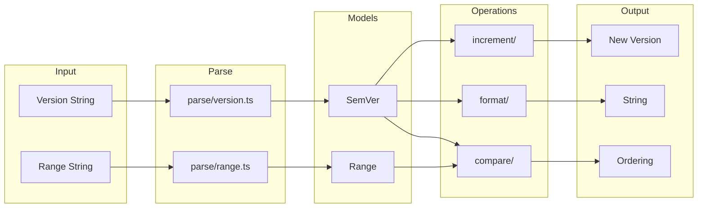

# semver/

Semantic versioning utilities for parsing, comparing, formatting, and incrementing versions.

## Overview

Complete implementation of the [Semantic Versioning 2.0.0](https://semver.org/) specification. Parsing uses character-by-character state machines for predictable O(n) performance.



## API

### Models

| Export          | Description                                                                                         | Implementation                    |
| --------------- | --------------------------------------------------------------------------------------------------- | --------------------------------- |
| `SemVer`        | Semantic version with major, minor, patch, prerelease, and build metadata                           | [version.ts](./models/version.ts) |
| `BumpType`      | `'major' \| 'minor' \| 'patch' \| 'premajor' \| 'preminor' \| 'prepatch' \| 'prerelease' \| 'none'` | [version.ts](./models/version.ts) |
| `Range`         | Version range with multiple comparator sets (OR logic)                                              | [range.ts](./models/range.ts)     |
| `ComparatorSet` | Set of comparators that must all match (AND logic)                                                  | [range.ts](./models/range.ts)     |
| `Comparator`    | Single comparison: operator + version                                                               | [range.ts](./models/range.ts)     |
| `RangeOperator` | `'=' \| '>' \| '>=' \| '<' \| '<=' \| '^' \| '~'`                                                   | [range.ts](./models/range.ts)     |

### Factories

| Function                     | Description                         | Implementation                    |
| ---------------------------- | ----------------------------------- | --------------------------------- |
| `createSemVer(opts)`         | Create a new SemVer from components | [version.ts](./models/version.ts) |
| `createInitialVersion()`     | Create version 0.0.0                | [version.ts](./models/version.ts) |
| `createFirstRelease()`       | Create version 1.0.0                | [version.ts](./models/version.ts) |
| `createComparator(op, ver)`  | Create a comparator                 | [range.ts](./models/range.ts)     |
| `createComparatorSet(comps)` | Create a comparator set             | [range.ts](./models/range.ts)     |
| `createRange(sets, raw?)`    | Create a range                      | [range.ts](./models/range.ts)     |
| `createAnyRange()`           | Create range matching any version   | [range.ts](./models/range.ts)     |

### Parsing

| Function                     | Description                                                | Implementation                   |
| ---------------------------- | ---------------------------------------------------------- | -------------------------------- |
| `parseVersion(input)`        | Parse version string to SemVer (returns `null` on invalid) | [version.ts](./parse/version.ts) |
| `parseVersionOrThrow(input)` | Parse version string, throws on invalid                    | [version.ts](./parse/version.ts) |
| `coerceVersion(input)`       | Best-effort parsing with prefix stripping                  | [version.ts](./parse/version.ts) |
| `parseRange(input)`          | Parse range string (returns `null` on invalid)             | [range.ts](./parse/range.ts)     |
| `parseRangeOrThrow(input)`   | Parse range string, throws on invalid                      | [range.ts](./parse/range.ts)     |

### Comparison

| Function                   | Description                              | Implementation                     |
| -------------------------- | ---------------------------------------- | ---------------------------------- |
| `compare(a, b)`            | Returns -1, 0, or 1 for version ordering | [compare.ts](./compare/compare.ts) |
| `eq(a, b)`                 | Test equality (ignores build metadata)   | [compare.ts](./compare/compare.ts) |
| `lt(a, b)`                 | Test a < b                               | [compare.ts](./compare/compare.ts) |
| `lte(a, b)`                | Test a <= b                              | [compare.ts](./compare/compare.ts) |
| `gt(a, b)`                 | Test a > b                               | [compare.ts](./compare/compare.ts) |
| `gte(a, b)`                | Test a >= b                              | [compare.ts](./compare/compare.ts) |
| `satisfies(ver, range)`    | Test if version satisfies range          | [compare.ts](./compare/compare.ts) |
| `sort(versions)`           | Sort ascending, returns new array        | [sort.ts](./compare/sort.ts)       |
| `sortDescending(versions)` | Sort descending, returns new array       | [sort.ts](./compare/sort.ts)       |
| `max(versions)`            | Find maximum version                     | [sort.ts](./compare/sort.ts)       |
| `min(versions)`            | Find minimum version                     | [sort.ts](./compare/sort.ts)       |

### Formatting

| Function                 | Description                           | Implementation                        |
| ------------------------ | ------------------------------------- | ------------------------------------- |
| `format(version)`        | Full string with prerelease and build | [to-string.ts](./format/to-string.ts) |
| `formatSimple(version)`  | Just major.minor.patch                | [to-string.ts](./format/to-string.ts) |
| `formatRange(range)`     | Range to string                       | [to-string.ts](./format/to-string.ts) |
| `formatComparator(comp)` | Comparator to string                  | [to-string.ts](./format/to-string.ts) |

### Increment

| Function                       | Description                        | Implementation                 |
| ------------------------------ | ---------------------------------- | ------------------------------ |
| `bump(version, type)`          | Increment version by bump type     | [bump.ts](./increment/bump.ts) |
| `bumpMajor(version)`           | Increment major, reset minor/patch | [bump.ts](./increment/bump.ts) |
| `bumpMinor(version)`           | Increment minor, reset patch       | [bump.ts](./increment/bump.ts) |
| `bumpPatch(version)`           | Increment patch                    | [bump.ts](./increment/bump.ts) |
| `bumpPrerelease(version, id?)` | Increment or add prerelease        | [bump.ts](./increment/bump.ts) |

## Usage Examples

### Parsing Versions

```typescript
import { parseVersion, parseVersionOrThrow, coerceVersion } from '@hyperfrontend/versioning'

// Safe parsing (returns null on invalid)
const v1 = parseVersion('1.2.3') // SemVer { major: 1, minor: 2, patch: 3 }
const v2 = parseVersion('invalid') // null

// Strict parsing (throws on invalid)
const v3 = parseVersionOrThrow('2.0.0-beta.1')

// Coerce with best effort
const v4 = coerceVersion('v1.2.3') // strips 'v' prefix
const v5 = coerceVersion('1.2') // normalizes to 1.2.0
```

### Comparing Versions

```typescript
import { compare, gt, lt, satisfies, parseVersion, parseRange } from '@hyperfrontend/versioning'

const a = parseVersion('1.0.0')!
const b = parseVersion('2.0.0')!

compare(a, b) // -1 (a < b)
gt(b, a) // true
lt(a, b) // true

// Range satisfaction
const range = parseRange('^1.0.0')!
satisfies(parseVersion('1.5.0')!, range) // true
satisfies(parseVersion('2.0.0')!, range) // false
```

### Incrementing Versions

```typescript
import { bump, parseVersion, format } from '@hyperfrontend/versioning'

const version = parseVersion('1.2.3')!

format(bump(version, 'major')) // '2.0.0'
format(bump(version, 'minor')) // '1.3.0'
format(bump(version, 'patch')) // '1.2.4'
format(bump(version, 'prerelease')) // '1.2.4-0'
```

### Sorting Versions

```typescript
import { sort, max, min, parseVersion, format } from '@hyperfrontend/versioning'

const versions = [parseVersion('2.0.0')!, parseVersion('1.0.0')!, parseVersion('1.5.0')!]

sort(versions).map(format) // ['1.0.0', '1.5.0', '2.0.0']
format(max(versions)!) // '2.0.0'
format(min(versions)!) // '1.0.0'
```

## Directory Structure

```
semver/
├── models/           # Data structures
│   ├── version.ts    # SemVer type and factories
│   └── range.ts      # Range, ComparatorSet, Comparator
├── parse/            # String → Model
│   ├── version.ts    # Version parsing
│   └── range.ts      # Range parsing
├── compare/          # Comparison operations
│   ├── compare.ts    # Ordering and equality
│   └── sort.ts       # Array sorting, min, max
├── format/           # Model → String
│   └── to-string.ts  # Formatting functions
├── increment/        # Version mutations
│   └── bump.ts       # Bump operations
└── index.ts          # Public exports
```

## Design Principles

1. **Immutable** — All operations return new objects
2. **Pure Functions** — No side effects, deterministic output
3. **No Regex** — Character-by-character parsing eliminates ReDoS
4. **Null Safety** — Parse functions return `null` on invalid input
5. **Factory Pattern** — Use `create*` functions for object construction

## See Also

- [changelog/](../changelog/README.md) — Uses semver for version entries
- [flow/](../flow/README.md) — Uses semver for bump calculations
- [commits/](../commits/README.md) — Maps commit types to bump types
- [registry/](../registry/README.md) — Queries published versions
- [workspace/](../workspace/README.md) — Cascade bump calculations
- [Main README](../../README.md) — Package overview and quick start
- [ARCHITECTURE.md](../../ARCHITECTURE.md) — Design principles and data flow
