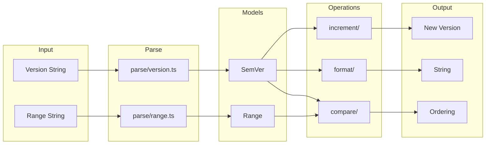

# semver/

Semantic versioning utilities for parsing, comparing, formatting, and incrementing versions.

## Overview

Complete implementation of the [Semantic Versioning 2.0.0](https://semver.org/) specification. Parsing uses character-by-character state machines for predictable O(n) performance.



## Usage Examples

### Parsing Versions

```typescript
import { parseVersion, parseVersionOrThrow, coerceVersion } from '@hyperfrontend/versioning'

// Safe parsing (returns null on invalid)
const v1 = parseVersion('1.2.3') // SemVer { major: 1, minor: 2, patch: 3 }
const v2 = parseVersion('invalid') // null

// Strict parsing (throws on invalid)
const v3 = parseVersionOrThrow('2.0.0-beta.1')

// Coerce with best effort
const v4 = coerceVersion('v1.2.3') // strips 'v' prefix
const v5 = coerceVersion('1.2') // normalizes to 1.2.0
```

### Comparing Versions

```typescript
import { compare, gt, lt, satisfies, parseVersion, parseRange } from '@hyperfrontend/versioning'

const a = parseVersion('1.0.0')!
const b = parseVersion('2.0.0')!

compare(a, b) // -1 (a < b)
gt(b, a) // true
lt(a, b) // true

// Range satisfaction
const range = parseRange('^1.0.0')!
satisfies(parseVersion('1.5.0')!, range) // true
satisfies(parseVersion('2.0.0')!, range) // false
```

### Incrementing Versions

```typescript
import { bump, parseVersion, format } from '@hyperfrontend/versioning'

const version = parseVersion('1.2.3')!

format(bump(version, 'major')) // '2.0.0'
format(bump(version, 'minor')) // '1.3.0'
format(bump(version, 'patch')) // '1.2.4'
format(bump(version, 'prerelease')) // '1.2.4-0'
```

### Sorting Versions

```typescript
import { sort, max, min, parseVersion, format } from '@hyperfrontend/versioning'

const versions = [parseVersion('2.0.0')!, parseVersion('1.0.0')!, parseVersion('1.5.0')!]

sort(versions).map(format) // ['1.0.0', '1.5.0', '2.0.0']
format(max(versions)!) // '2.0.0'
format(min(versions)!) // '1.0.0'
```

## Design Principles

1. **Immutable**: All operations return new objects
2. **Pure Functions**: No side effects, deterministic output
3. **No Regex**: Character-by-character parsing eliminates ReDoS
4. **Null Safety**: Parse functions return `null` on invalid input
5. **Factory Pattern**: Use `create*` functions for object construction

## See Also

- [changelog/](../changelog/README.md): Uses semver for version entries
- [flow/](../flow/README.md): Uses semver for bump calculations
- [commits/](../commits/README.md): Maps commit types to bump types
- [registry/](../registry/README.md): Queries published versions
- [workspace/](../workspace/README.md): Cascade bump calculations
- [Main README](../../README.md): Package overview and quick start
- [ARCHITECTURE.md](../../ARCHITECTURE.md): Design principles and data flow
