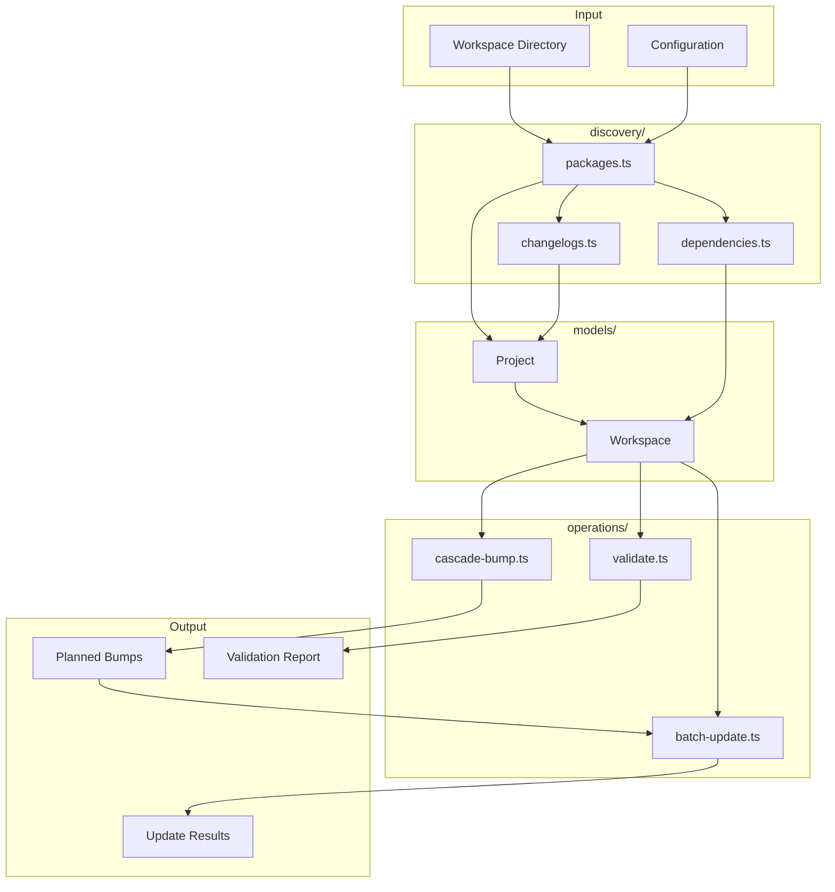

# workspace/

Workspace-level utilities for monorepo package discovery, dependency tracking, cascade versioning, and batch operations.

## Overview

This module provides tools for working with multi-package workspaces (monorepos). It handles package discovery, builds dependency graphs, calculates cascade bumps when releasing, and performs batch updates across packages.



## Configuration

### Cascade Bumps

**CascadeOptions:**

| Option                    | Default   | Description                                |
| ------------------------- | --------- | ------------------------------------------ |
| `cascadeBumpType`         | `'patch'` | Bump type for cascaded dependents          |
| `includeDevDependencies`  | `false`   | Cascade through dev dependencies           |
| `includePeerDependencies` | `true`    | Cascade through peer dependencies          |
| `prereleaseId`            | `'alpha'` | Prerelease identifier for prerelease bumps |

### Batch Updates

**BatchOptions:**

| Option                     | Default | Description                              |
| -------------------------- | ------- | ---------------------------------------- |
| `dryRun`                   | `false` | Preview changes without writing          |
| `updateChangelogs`         | `true`  | Update changelog files                   |
| `updateDependencyVersions` | `true`  | Update dependency version ranges         |
| `createGitCommit`          | `false` | Create git commit after updates          |
| `createGitTag`             | `false` | Create git tags for each updated package |

### Validation

**ValidationOptions:**

| Option           | Description                 |
| ---------------- | --------------------------- |
| `customRules`    | Additional validation rules |
| `ignoreProjects` | Projects to skip validation |
| `disabledRules`  | Rules to disable            |

**Built-in Validation Rules:**

| Rule                    | Severity | Description                                |
| ----------------------- | -------- | ------------------------------------------ |
| `valid-version`         | error    | Version must be valid semver               |
| `valid-name`            | error    | Package name required                      |
| `valid-name-format`     | error    | Package name must follow npm conventions   |
| `no-self-dependency`    | error    | Package cannot depend on itself            |
| `no-circular-deps`      | error    | No circular dependencies in workspace      |
| `version-compatibility` | warning  | Internal deps should be compatible         |
| `has-changelog`         | warning  | Publishable packages should have changelog |
| `no-prerelease-deps`    | warning  | Avoid prerelease external dependencies     |
| `no-wildcard-deps`      | warning  | Avoid wildcard version ranges              |
| `no-git-deps`           | warning  | Avoid git URL dependencies                 |

## Usage Example

```typescript
import {
  discoverPackages,
  buildDependencyGraph,
  createWorkspace,
  calculateCascadeBumps,
  applyBumps,
  validateWorkspace,
} from '@hyperfrontend/versioning'

// 1. Discover workspace
const projects = await discoverPackages('/path/to/monorepo')
const depGraph = buildDependencyGraph(projects)
const workspace = createWorkspace({
  root: '/path/to/monorepo',
  type: 'nx',
  projects,
  dependencyGraph: depGraph,
  reverseDependencyGraph: buildReverseDependencyGraph(depGraph),
})

// 2. Validate workspace
const report = validateWorkspace(workspace)
if (!report.isValid) {
  console.error(formatValidationReport(report))
  process.exit(1)
}

// 3. Calculate cascade bumps
const result = calculateCascadeBumps(workspace, [{ name: 'core', bumpType: 'minor' }])
console.log(summarizeCascadeBumps(result))
// Output: "3 package(s) affected (1 direct, 2 cascade)"

// 4. Apply bumps
const updateResult = applyBumps(workspace, result.bumps, {
  dryRun: true,
  updateChangelogs: true,
})
console.log(formatBatchResult(updateResult))
```

## Dependencies

Uses `@hyperfrontend/project-scope` for file system operations and workspace detection. Uses `@hyperfrontend/immutable-api-utils` for immutable data structures.

## See Also

- [git/](../git/README.md) — Git operations for version coordination
- [changelog/](../changelog/README.md) — Changelog discovery and manipulation
- [flow/](../flow/README.md) — Orchestrates workspace-wide versioning
- [semver/](../semver/README.md) — Version parsing for cascade calculations
- [@hyperfrontend/project-scope](../../../project-scope/README.md) — Virtual file system
- [Main README](../../README.md) — Package overview and quick start
- [ARCHITECTURE.md](../../ARCHITECTURE.md) — Design principles and data flow
