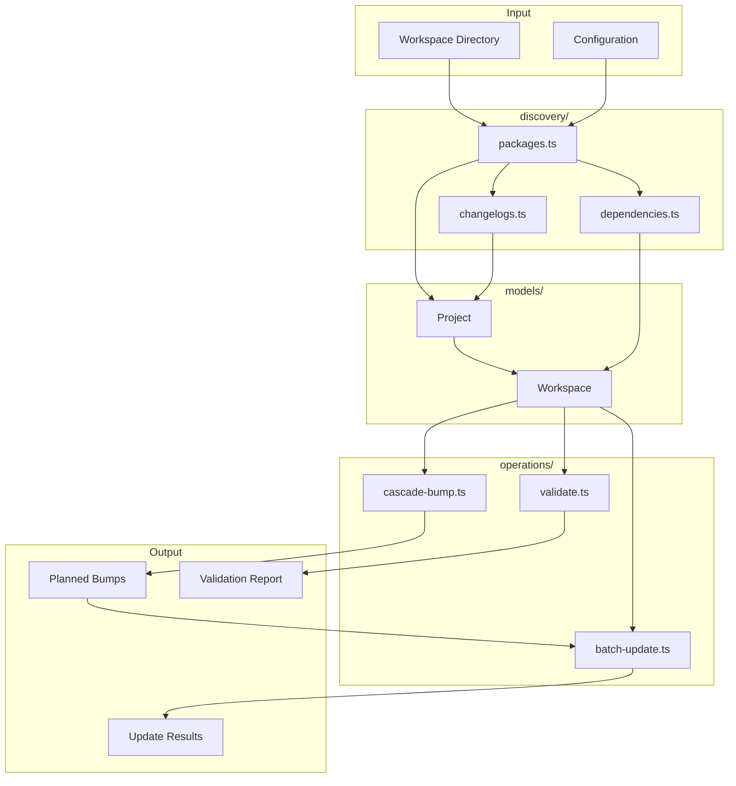
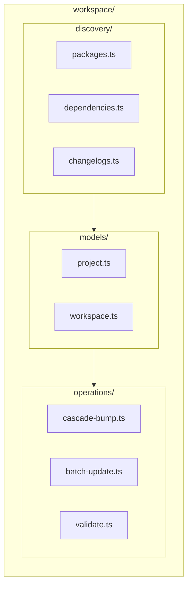

# workspace/

Workspace-level utilities for monorepo package discovery, dependency tracking, cascade versioning, and batch operations.

## Overview

This module provides tools for working with multi-package workspaces (monorepos). It handles package discovery, builds dependency graphs, calculates cascade bumps when releasing, and performs batch updates across packages.



## Module Structure



## API

### Models

| Export            | Description                                             | Implementation                        |
| ----------------- | ------------------------------------------------------- | ------------------------------------- |
| `Project`         | Single project/package within a workspace               | [project.ts](./models/project.ts)     |
| `Workspace`       | Monorepo workspace with multiple projects               | [workspace.ts](./models/workspace.ts) |
| `WorkspaceConfig` | Configuration for workspace operations                  | [workspace.ts](./models/workspace.ts) |
| `WorkspaceType`   | Type of workspace: `nx`, `turbo`, `lerna`, `pnpm`, etc. | [workspace.ts](./models/workspace.ts) |

### Factories

| Function                   | Description                     | Implementation                        |
| -------------------------- | ------------------------------- | ------------------------------------- |
| `createProject(opts)`      | Create a Project from options   | [project.ts](./models/project.ts)     |
| `createWorkspace(opts)`    | Create a Workspace from options | [workspace.ts](./models/workspace.ts) |
| `DEFAULT_WORKSPACE_CONFIG` | Default workspace configuration | [workspace.ts](./models/workspace.ts) |

### Discovery

| Function                            | Description                                      | Implementation                                               |
| ----------------------------------- | ------------------------------------------------ | ------------------------------------------------------------ |
| `discoverPackages(root, opts?)`     | Discover all packages in workspace               | [packages.ts](./discovery/packages.ts)                       |
| `discoverProject(dir)`              | Discover single project from directory           | [packages.ts](./discovery/packages.ts)                       |
| `buildDependencyGraph(projects)`    | Build dependency graph from projects             | [dependencies.ts](./discovery/dependencies.ts)               |
| `getTopologicalOrder(workspace)`    | Get packages in topological build order          | [dependencies.ts](./discovery/dependencies.ts)               |
| `getTransitiveDependents(ws, pkg)`  | Get all packages depending on pkg (transitively) | [dependencies.ts](./discovery/dependencies.ts)               |
| `discoverAllChangelogs(root)`       | Find all changelog files in workspace            | [discover-changelogs.ts](./discovery/discover-changelogs.ts) |
| `findProjectChangelog(projectPath)` | Find changelog for specific project              | [changelog-path.ts](./discovery/changelog-path.ts)           |

### Workspace Queries

| Function                         | Description                                     | Implementation                        |
| -------------------------------- | ----------------------------------------------- | ------------------------------------- |
| `getProject(workspace, name)`    | Get project by name                             | [workspace.ts](./models/workspace.ts) |
| `getDependents(workspace, name)` | Get direct dependents of a package              | [workspace.ts](./models/workspace.ts) |
| `dependsOn(workspace, pkg, dep)` | Check if pkg depends on dep                     | [workspace.ts](./models/workspace.ts) |
| `isPublishable(project)`         | Check if project can be published (not private) | [project.ts](./models/project.ts)     |
| `hasChangelog(project)`          | Check if project has changelog                  | [project.ts](./models/project.ts)     |

### Cascade Bumps

| Function                                          | Description                                    | Implementation                                  |
| ------------------------------------------------- | ---------------------------------------------- | ----------------------------------------------- |
| `calculateCascadeBumps(ws, bumps, opts?)`         | Calculate all bumps including cascades         | [cascade-bump.ts](./operations/cascade-bump.ts) |
| `calculateCascadeBumpsFromPackage(ws, pkg, type)` | Convenience: cascade from single package       | [cascade-bump.ts](./operations/cascade-bump.ts) |
| `summarizeCascadeBumps(result)`                   | Format cascade result as human-readable string | [cascade-bump.ts](./operations/cascade-bump.ts) |
| `DEFAULT_CASCADE_OPTIONS`                         | Default cascade bump options                   | [cascade-bump.ts](./operations/cascade-bump.ts) |

**CascadeOptions:**

| Option                    | Default   | Description                                |
| ------------------------- | --------- | ------------------------------------------ |
| `cascadeBumpType`         | `'patch'` | Bump type for cascaded dependents          |
| `includeDevDependencies`  | `false`   | Cascade through dev dependencies           |
| `includePeerDependencies` | `true`    | Cascade through peer dependencies          |
| `prereleaseId`            | `'alpha'` | Prerelease identifier for prerelease bumps |

### Batch Updates

| Function                       | Description                            | Implementation                                  |
| ------------------------------ | -------------------------------------- | ----------------------------------------------- |
| `applyBumps(ws, bumps, opts?)` | Apply planned bumps to packages        | [batch-update.ts](./operations/batch-update.ts) |
| `formatBatchResult(result)`    | Format result as human-readable string | [batch-update.ts](./operations/batch-update.ts) |
| `DEFAULT_BATCH_OPTIONS`        | Default batch update options           | [batch-update.ts](./operations/batch-update.ts) |

**BatchOptions:**

| Option                     | Default | Description                              |
| -------------------------- | ------- | ---------------------------------------- |
| `dryRun`                   | `false` | Preview changes without writing          |
| `updateChangelogs`         | `true`  | Update changelog files                   |
| `updateDependencyVersions` | `true`  | Update dependency version ranges         |
| `createGitCommit`          | `false` | Create git commit after updates          |
| `createGitTag`             | `false` | Create git tags for each updated package |

### Validation

| Function                         | Description                        | Implementation                          |
| -------------------------------- | ---------------------------------- | --------------------------------------- |
| `validateWorkspace(ws, opts?)`   | Validate entire workspace          | [validate.ts](./operations/validate.ts) |
| `validateProject(project)`       | Validate single project            | [validate.ts](./operations/validate.ts) |
| `formatValidationReport(report)` | Format validation report as string | [validate.ts](./operations/validate.ts) |

**ValidationOptions:**

| Option           | Description                 |
| ---------------- | --------------------------- |
| `customRules`    | Additional validation rules |
| `ignoreProjects` | Projects to skip validation |
| `disabledRules`  | Rules to disable            |

**Built-in Validation Rules:**

| Rule                    | Severity | Description                                |
| ----------------------- | -------- | ------------------------------------------ |
| `valid-version`         | error    | Version must be valid semver               |
| `valid-name`            | error    | Package name required                      |
| `valid-name-format`     | error    | Package name must follow npm conventions   |
| `no-self-dependency`    | error    | Package cannot depend on itself            |
| `no-circular-deps`      | error    | No circular dependencies in workspace      |
| `version-compatibility` | warning  | Internal deps should be compatible         |
| `has-changelog`         | warning  | Publishable packages should have changelog |
| `no-prerelease-deps`    | warning  | Avoid prerelease external dependencies     |
| `no-wildcard-deps`      | warning  | Avoid wildcard version ranges              |
| `no-git-deps`           | warning  | Avoid git URL dependencies                 |

## Usage Example

```typescript
import {
  discoverPackages,
  buildDependencyGraph,
  createWorkspace,
  calculateCascadeBumps,
  applyBumps,
  validateWorkspace,
} from '@hyperfrontend/versioning'

// 1. Discover workspace
const projects = await discoverPackages('/path/to/monorepo')
const depGraph = buildDependencyGraph(projects)
const workspace = createWorkspace({
  root: '/path/to/monorepo',
  type: 'nx',
  projects,
  dependencyGraph: depGraph,
  reverseDependencyGraph: buildReverseDependencyGraph(depGraph),
})

// 2. Validate workspace
const report = validateWorkspace(workspace)
if (!report.isValid) {
  console.error(formatValidationReport(report))
  process.exit(1)
}

// 3. Calculate cascade bumps
const result = calculateCascadeBumps(workspace, [{ name: 'core', bumpType: 'minor' }])
console.log(summarizeCascadeBumps(result))
// Output: "3 package(s) affected (1 direct, 2 cascade)"

// 4. Apply bumps
const updateResult = applyBumps(workspace, result.bumps, {
  dryRun: true,
  updateChangelogs: true,
})
console.log(formatBatchResult(updateResult))
```

## File Structure

```
workspace/
├── index.ts                 # Re-exports all public API
├── README.md                # This file
├── discovery/
│   ├── index.ts             # Discovery exports
│   ├── packages.ts          # Package discovery
│   ├── packages.spec.ts
│   ├── dependencies.ts      # Dependency graph building
│   ├── dependencies.spec.ts
│   ├── changelogs.ts        # Changelog discovery
│   └── changelogs.spec.ts
├── models/
│   ├── index.ts             # Model exports
│   ├── project.ts           # Project model & factories
│   ├── project.spec.ts
│   ├── workspace.ts         # Workspace model & factories
│   └── workspace.spec.ts
└── operations/
    ├── index.ts             # Operation exports
    ├── cascade-bump.ts      # Cascade bump calculation
    ├── cascade-bump.spec.ts
    ├── batch-update.ts      # Batch update operations
    ├── batch-update.spec.ts
    ├── validate.ts          # Workspace validation
    └── validate.spec.ts
```

## Dependencies

Uses `@hyperfrontend/project-scope` for file system operations and workspace detection. Uses `@hyperfrontend/immutable-api-utils` for immutable data structures.

## See Also

- [git/](../git/README.md) — Git operations for version coordination
- [changelog/](../changelog/README.md) — Changelog discovery and manipulation
- [flow/](../flow/README.md) — Orchestrates workspace-wide versioning
- [semver/](../semver/README.md) — Version parsing for cascade calculations
- [@hyperfrontend/project-scope](../../../project-scope/README.md) — Virtual file system
- [Main README](../../README.md) — Package overview and quick start
- [ARCHITECTURE.md](../../ARCHITECTURE.md) — Design principles and data flow
