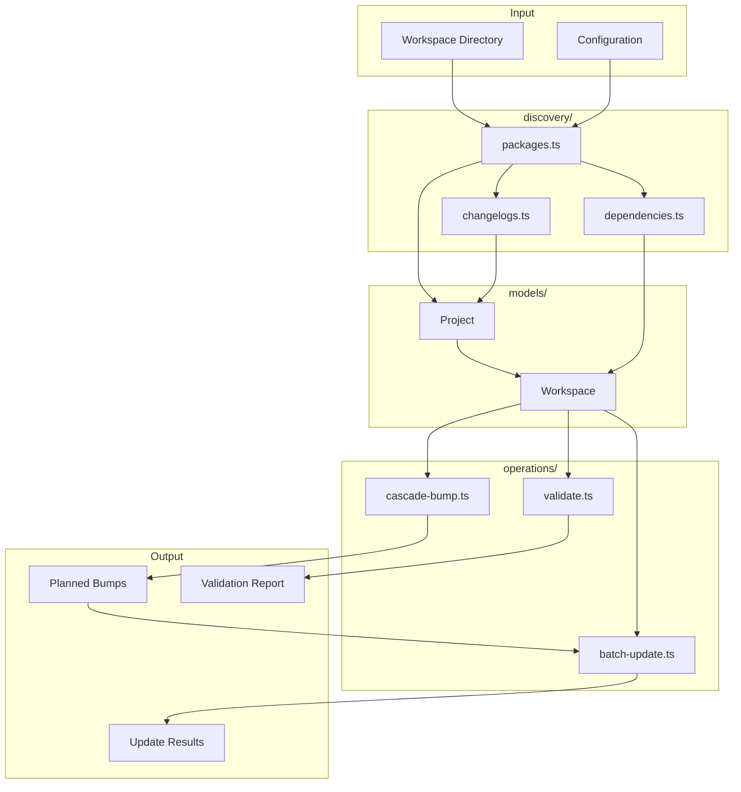

# workspace/

Workspace-level utilities for monorepo package discovery, dependency tracking, cascade versioning, and batch operations.

## Overview

This module provides tools for working with multi-package workspaces (monorepos). It handles package discovery, builds dependency graphs, calculates cascade bumps when releasing, and performs batch updates across packages.



## Configuration

### Cascade Bumps

**CascadeOptions:**

| Option                                                                                                                                                         | Default   | Description                                |
| -------------------------------------------------------------------------------------------------------------------------------------------------------------- | --------- | ------------------------------------------ |
| [`cascadeBumpType`](https://www.hyperfrontend.dev/docs/libraries/versioning/workspace/operations/#api-CascadeBumpOptions-prop-cascadeBumpType)                 | `'patch'` | Bump type for cascaded dependents          |
| [`includeDevDependencies`](https://www.hyperfrontend.dev/docs/libraries/versioning/workspace/operations/#api-CascadeBumpOptions-prop-includeDevDependencies)   | `false`   | Cascade through dev dependencies           |
| [`includePeerDependencies`](https://www.hyperfrontend.dev/docs/libraries/versioning/workspace/operations/#api-CascadeBumpOptions-prop-includePeerDependencies) | `true`    | Cascade through peer dependencies          |
| [`prereleaseId`](https://www.hyperfrontend.dev/docs/libraries/versioning/workspace/operations/#api-CascadeBumpOptions-prop-prereleaseId)                       | `'alpha'` | Prerelease identifier for prerelease bumps |

### Batch Updates

**[`BatchUpdateOptions`](https://www.hyperfrontend.dev/docs/libraries/versioning/workspace/operations/#api-BatchUpdateOptions):**

| Option                                                                                                                                                               | Default | Description                                                       |
| -------------------------------------------------------------------------------------------------------------------------------------------------------------------- | ------- | ----------------------------------------------------------------- |
| [`updateDependencyReferences`](https://www.hyperfrontend.dev/docs/libraries/versioning/workspace/operations/#api-BatchUpdateOptions-prop-updateDependencyReferences) | `true`  | Rewrite the version ranges other packages hold on the bumped ones |

### Validation

[`validateWorkspace`](https://www.hyperfrontend.dev/docs/libraries/versioning/workspace/operations/#api-validateWorkspace) takes no options: it runs every check below and returns a [`ValidationReport`](https://www.hyperfrontend.dev/docs/libraries/versioning/workspace/operations/#api-ValidationReport) whose [`ValidationCheckResult`](https://www.hyperfrontend.dev/docs/libraries/versioning/workspace/operations/#api-ValidationCheckResult) entries name the check and the package it ran against. [`validateProject`](https://www.hyperfrontend.dev/docs/libraries/versioning/workspace/operations/#api-validateProject) runs the per-package checks for one project.

**Built-in Validation Checks:**

| Check                      | Scope     | Description                                         |
| -------------------------- | --------- | --------------------------------------------------- |
| `workspace-has-projects`   | workspace | At least one project was discovered                 |
| `no-circular-dependencies` | workspace | No circular dependencies between internal packages  |
| `valid-version`            | package   | Version must be valid semver                        |
| `valid-name`               | package   | Package name must follow npm conventions            |
| `dependency-versions`      | package   | Internal dependencies must name versions that exist |

## Usage Example

```typescript
import {
  discoverPackages,
  buildDependencyGraph,
  createWorkspace,
  calculateCascadeBumps,
  applyBumps,
  validateWorkspace,
} from '@hyperfrontend/versioning'

// 1. Discover workspace
const projects = await discoverPackages('/path/to/monorepo')
const depGraph = buildDependencyGraph(projects)
const workspace = createWorkspace({
  root: '/path/to/monorepo',
  type: 'nx',
  projects,
  dependencyGraph: depGraph,
  reverseDependencyGraph: buildReverseDependencyGraph(depGraph),
})

// 2. Validate workspace
const report = validateWorkspace(workspace)
if (!report.isValid) {
  console.error(formatValidationReport(report))
  process.exit(1)
}

// 3. Calculate cascade bumps
const result = calculateCascadeBumps(workspace, [{ name: 'core', bumpType: 'minor' }])
console.log(summarizeCascadeBumps(result))
// Output: "3 package(s) affected (1 direct, 2 cascade)"

// 4. Apply bumps
const updateResult = applyBumps(workspace, result.bumps, {
  dryRun: true,
  updateChangelogs: true,
})
console.log(formatBatchResult(updateResult))
```

## Dependencies

Uses [`@hyperfrontend/project-scope`](https://www.hyperfrontend.dev/docs/libraries/project-scope/) for file system operations and workspace detection. Uses [`@hyperfrontend/immutable-api-utils`](https://www.hyperfrontend.dev/docs/libraries/utils/immutable-api/) for immutable data structures.

## See Also

- [git/](../git/README.md): Git operations for version coordination
- [changelog/](../changelog/README.md): Changelog discovery and manipulation
- [flow/](../flow/README.md): Orchestrates workspace-wide versioning
- [semver/](../semver/README.md): Version parsing for cascade calculations
- [@hyperfrontend/project-scope](../../../project-scope/README.md): Virtual file system
- [Main README](../../README.md): Package overview and quick start
- [ARCHITECTURE.md](../../ARCHITECTURE.md): Design principles and data flow
