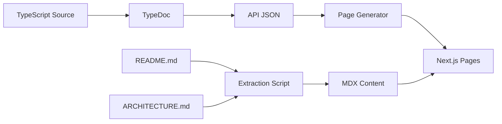

# Phase 2: Content

**Documentation Roadmap — Phase 2 of 4**

Populate the documentation site with comprehensive API documentation and project content.

---

## Objective

Implement automated content extraction from the codebase, providing complete API documentation for all libraries and integrating existing markdown content from project READMEs and architecture documents.

---

## Prerequisites

- [Phase 1: Foundation](./documentation-phase-1-foundation.md) complete
- Next.js site deployed and accessible
- Navigation structure in place

---

## Deliverables

### 2.1 TypeDoc Integration

- [x] Install and configure [TypeDoc](https://typedoc.org/)
- [x] Create TypeDoc configuration per library project
- [x] Generate JSON output for programmatic consumption
- [x] Build TypeDoc → Next.js page generation pipeline
- [x] Style API reference pages with Tailwind

**Libraries to document:**

| Package                                 | Entry Points                       |
| --------------------------------------- | ---------------------------------- |
| `@hyperfrontend/nexus`                  | 1                                  |
| `@hyperfrontend/network-protocol`       | 1                                  |
| `@hyperfrontend/cryptography`           | 3 (`/browser`, `/node`, `/common`) |
| `@hyperfrontend/state-machine`          | 1                                  |
| `@hyperfrontend/logging`                | 1                                  |
| `@hyperfrontend/web-worker`             | 1                                  |
| `@hyperfrontend/utils/data`             | 1                                  |
| `@hyperfrontend/utils/function`         | 1                                  |
| `@hyperfrontend/utils/immutable-api`    | 1                                  |
| `@hyperfrontend/utils/list`             | 1                                  |
| `@hyperfrontend/utils/random-generator` | 1                                  |
| `@hyperfrontend/utils/string`           | 1                                  |
| `@hyperfrontend/utils/time`             | 1                                  |
| `@hyperfrontend/utils/ui`               | 1                                  |
| `@hyperfrontend/features`               | 1                                  |

**Acceptance Criteria:**

- All public exports have generated documentation
- Function signatures, parameters, return types displayed
- `@remarks` tags render as extended descriptions
- `@example` tags render as code blocks
- Type links navigate to type definitions

### 2.2 README Extraction

- [x] Create markdown extraction script
- [x] Process each project's `README.md`
- [x] Extract relevant sections (skip badges, contributors)
- [x] Render as project overview pages
- [x] Maintain section anchors for deep linking

**Source files:**

- [libs/nexus/README.md](../libs/nexus/README.md)
- [libs/cryptography/README.md](../libs/cryptography/README.md)
- [libs/network-protocol/README.md](../libs/network-protocol/README.md)
- [libs/state-machine/README.md](../libs/state-machine/README.md)
- [libs/logging/README.md](../libs/logging/README.md)
- [libs/web-worker/README.md](../libs/web-worker/README.md)
- [plugins/features/README.md](../plugins/features/README.md)
- All `libs/utils/*/README.md` files

**Acceptance Criteria:**

- Each library has an overview page from README
- Code examples syntax-highlighted
- Installation instructions accurate
- "Why use this?" sections visible

### 2.3 Architecture Documentation

- [x] Extract content from `ARCHITECTURE.md` files
- [x] Render Mermaid diagrams as SVG
- [x] Create architecture overview page
- [x] Link architecture pages to relevant library pages

**Source files:**

- [ARCHITECTURE.md](../ARCHITECTURE.md) (root)
- [libs/nexus/ARCHITECTURE.md](../libs/nexus/ARCHITECTURE.md)

**Acceptance Criteria:**

- All Mermaid diagrams render correctly
- ASCII art preserved in code blocks
- Architecture pages accessible from navigation
- Cross-links to library documentation work

### 2.4 Mermaid Rendering

- [x] Integrate Mermaid.js or server-side rendering
- [x] Configure theme to match site design
- [x] Handle diagrams in both markdown and JSDoc
- [x] Ensure diagrams scale on mobile

**Acceptance Criteria:**

- All existing diagrams render
- Consistent styling with site theme
- Diagrams readable on mobile devices

### 2.5 Link Transformation

- [x] Build link transformation script
- [x] Convert GitHub blob URLs to docs site URLs
- [x] Convert workspace-relative links to docs URLs
- [ ] Validate all links during build
- [ ] Report broken links as build warnings

**Link transformation rules:**

| Pattern                                                                         | Transformation            |
| ------------------------------------------------------------------------------- | ------------------------- |
| `https://github.com/AndrewRedican/hyperfrontend/blob/main/libs/nexus/README.md` | `/docs/libs/nexus`        |
| `./ARCHITECTURE.md`                                                             | `/docs/architecture`      |
| `../../libs/cryptography/README.md`                                             | `/docs/libs/cryptography` |
| `#section-name`                                                                 | Preserve as anchor        |

**Acceptance Criteria:**

- No broken internal links
- GitHub links transformed to docs links
- External links remain unchanged
- Anchors work correctly

### 2.6 Contributing Section

- [x] Extract content from [CONTRIBUTING.md](../CONTRIBUTING.md)
- [x] Create dedicated Contributing section
- [x] Include setup instructions
- [x] Link to GitHub for PRs and issues

**Content sections:**

- Development Setup
- Making Changes
- Submitting a Pull Request
- Coding Standards
- Commit Message Guidelines

**Acceptance Criteria:**

- Contributing guide accurate and complete
- Codespaces setup instructions included
- Link to CLA visible

### 2.7 Build Automation

- [x] Add TypeDoc generation to CI pipeline
- [x] Create `docs:build` Nx target
- [x] Configure incremental builds
- [x] Add build step to release workflow

**Acceptance Criteria:**

- `npx nx build docs-site` generates all content
- Build completes in < 5 minutes
- Nx caching accelerates repeated builds

---

## Technical Specifications

### TypeDoc Configuration

```json
{
  "entryPoints": ["./src/index.ts"],
  "out": "./docs-output",
  "json": "./api.json",
  "excludePrivate": true,
  "excludeInternal": true,
  "excludeNotDocumented": false,
  "readme": "none"
}
```

### Content Pipeline



### Dependencies

| Package                                 | Purpose                      | Status       |
| --------------------------------------- | ---------------------------- | ------------ |
| `typedoc`                               | API documentation generation | ✅ Installed |
| `typedoc-plugin-markdown`               | Markdown output (optional)   | Not needed   |
| `mermaid`                               | Diagram rendering            | ✅ Installed |
| `@mdx-js/react`                         | MDX content handling         | Not needed   |
| `remark` / `remark-gfm` / `remark-html` | Markdown processing          | ✅ Installed |
| `gray-matter`                           | Frontmatter parsing          | ✅ Installed |
| `tsx`                                   | TypeScript script execution  | ✅ Installed |

---

## Success Metrics

| Metric           | Target                   |
| ---------------- | ------------------------ |
| API coverage     | 100% of public exports   |
| README coverage  | All 15 project READMEs   |
| Broken links     | 0                        |
| Build time       | < 5 minutes              |
| Mermaid diagrams | 100% rendering correctly |

---

## Risks & Mitigations

| Risk                             | Mitigation                                |
| -------------------------------- | ----------------------------------------- |
| TypeDoc output format changes    | Pin version; create abstraction layer     |
| Complex JSDoc not rendering      | Test with edge cases early; adjust config |
| Markdown variations break parser | Use robust parser; handle edge cases      |
| Build times grow with content    | Implement incremental generation          |

---

## Related Documents

- [Documentation Roadmap](./documentation-roadmap.md) — Master plan
- [Phase 1: Foundation](./documentation-phase-1-foundation.md) — Previous phase
- [Phase 3: Discovery](./documentation-phase-3-discovery.md) — Next phase
- [documentation-enrichment-plan.md](../_/documentation-enrichment-plan.md) — README enrichment
