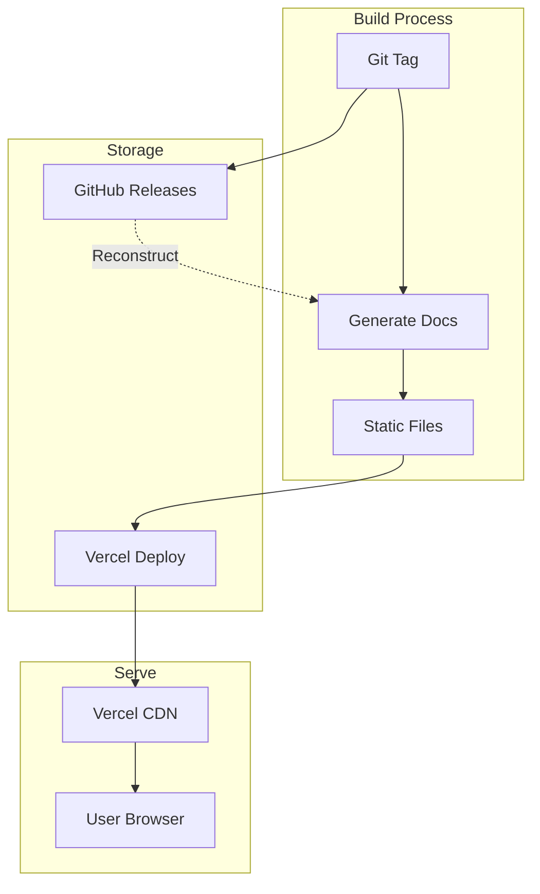

# Phase 3: Discovery

**Documentation Roadmap — Phase 3 of 4**

Implement search, versioning, and SEO optimization to make documentation discoverable.

---

## Objective

Enable users to find documentation through search engines, fuzzy search within the site, and version-specific navigation. Transform the site from a collection of pages into a discoverable, searchable knowledge base.

---

## Prerequisites

- [Phase 2: Content](./documentation-phase-2-content.md) complete
- All API documentation generated
- Content pages populated

---

## Deliverables

### 3.1 Algolia DocSearch Integration

- [ ] Apply for [Algolia DocSearch](https://docsearch.algolia.com/) (free for open-source)
- [ ] Configure crawler for site structure
- [ ] Implement search UI component
- [ ] Add keyboard shortcut (Cmd/Ctrl + K)
- [ ] Style search modal to match site theme
- [ ] Configure search result ranking

**Search scope:**

- All API reference pages
- README content pages
- Architecture documentation
- Getting Started guides
- Contributing section

**Acceptance Criteria:**

- Search available from every page
- Results appear within 200ms
- Keyboard navigation works in results
- Deep links to specific sections work

### 3.2 Version Selector

- [ ] Create version dropdown component
- [ ] Display current version prominently
- [ ] Load available versions from API/config
- [ ] Navigate to same page in different version
- [ ] Handle missing pages in older versions gracefully

**Version display:**

```
v2.1.0 (latest)
v2.0.0
v1.5.0
v1.4.0
...
```

**Acceptance Criteria:**

- Version selector visible on all doc pages
- Switching versions preserves current page when possible
- "Latest" clearly marked
- Graceful fallback for discontinued pages

### 3.3 Versioned URL Structure

- [ ] Implement URL pattern: `/docs/v{version}/{path}`
- [ ] Configure Next.js dynamic routes
- [ ] Set up redirects from unversioned URLs
- [ ] Handle `latest` alias

**URL examples:**

| URL                       | Content                     |
| ------------------------- | --------------------------- |
| `/docs/v2.1.0/libs/nexus` | Nexus docs for v2.1.0       |
| `/docs/latest/libs/nexus` | Redirects to latest version |
| `/docs/libs/nexus`        | Redirects to latest version |

**Acceptance Criteria:**

- All versioned URLs resolve correctly
- Canonical URLs set properly
- Old bookmarks continue working via redirects

### 3.4 Version Build Pipeline

- [ ] Create script to build docs from Git tags
- [ ] Store version metadata (date, Git SHA)
- [ ] Generate version manifest file
- [ ] Integrate with release workflow
- [ ] Implement version pruning (keep last 10 major)

**Build triggers:**

- New Git tag matching `@hyperfrontend/*@*` pattern
- Manual rebuild via GitHub Action workflow dispatch
- Scheduled weekly rebuild of latest

**Acceptance Criteria:**

- New releases automatically generate versioned docs
- Version manifest lists all available versions
- Older versions can be rebuilt from tags
- Storage stays within Vercel limits

### 3.5 SEO Meta Tags

- [ ] Add `<title>` tags per page
- [ ] Configure `<meta name="description">`
- [ ] Add Open Graph tags for social sharing
- [ ] Add Twitter Card tags
- [ ] Add canonical URLs

**Meta tag template:**

```html
<title>{Page Title} | HyperFrontend Documentation</title>
<meta name="description" content="{Page description from content}" />
<meta property="og:title" content="{Page Title}" />
<meta property="og:description" content="{Page description}" />
<meta property="og:image" content="/og-image.png" />
<meta property="og:url" content="https://hyperfrontend.dev/{path}" />
<link rel="canonical" href="https://hyperfrontend.dev/{path}" />
```

**Acceptance Criteria:**

- Every page has unique, descriptive title
- Descriptions derive from content
- Social shares show rich previews

### 3.6 Sitemap Generation

- [ ] Generate `sitemap.xml` at build time
- [ ] Include all documentation pages
- [ ] Add `lastmod` dates from Git history
- [ ] Configure `robots.txt`
- [ ] Submit sitemap to Google Search Console

**Acceptance Criteria:**

- Sitemap validates against XML schema
- All public pages included
- `robots.txt` allows indexing
- Google Search Console shows sitemap submitted

### 3.7 Structured Data

- [ ] Add JSON-LD for documentation pages
- [ ] Implement BreadcrumbList schema
- [ ] Add SoftwareSourceCode schema for code examples
- [ ] Test with Google Rich Results Test

**Schema.org types:**

- `TechArticle` for documentation pages
- `BreadcrumbList` for navigation
- `SoftwareApplication` for library pages

**Acceptance Criteria:**

- Rich Results Test passes
- No structured data errors in Search Console

### 3.8 Search Index Management

- [ ] Configure Algolia facets for version filtering
- [ ] Set up index update on deployment
- [ ] Monitor search analytics
- [ ] Configure synonyms for common terms

**Facets:**

- `version` — Filter by documentation version
- `type` — Filter by content type (API, Guide, Architecture)
- `package` — Filter by library package

**Acceptance Criteria:**

- Version filtering works in search
- Search analytics visible in Algolia dashboard
- Common misspellings handled via synonyms

---

## Technical Specifications

### Version Storage Architecture



### Algolia Configuration

```javascript
{
  index_name: 'hyperfrontend',
  start_urls: ['https://hyperfrontend.dev/docs/'],
  selectors: {
    lvl0: '.nav-section',
    lvl1: 'h1',
    lvl2: 'h2',
    lvl3: 'h3',
    text: 'p, li, td'
  },
  custom_settings: {
    attributesForFaceting: ['version', 'type', 'package']
  }
}
```

### Dependencies

| Package            | Purpose                 |
| ------------------ | ----------------------- |
| `@docsearch/react` | Search UI component     |
| `next-sitemap`     | Sitemap generation      |
| `next-seo`         | SEO meta tag management |

---

## Success Metrics

| Metric                 | Target                         |
| ---------------------- | ------------------------------ |
| Search latency         | < 200ms                        |
| Google indexing        | 100% of pages within 30 days   |
| Core Web Vitals        | All green                      |
| Version switching time | < 500ms                        |
| Search result accuracy | Top result relevant 90%+ times |

---

## Risks & Mitigations

| Risk                     | Mitigation                                  |
| ------------------------ | ------------------------------------------- |
| Algolia approval delayed | Start application early; have backup plan   |
| Version URL complexity   | Test extensively; implement redirects early |
| Search index grows large | Configure facets; monitor Algolia limits    |
| SEO takes time to impact | Track rankings; iterate on meta content     |

---

## Related Documents

- [Documentation Roadmap](./documentation-roadmap.md) — Master plan
- [Phase 2: Content](./documentation-phase-2-content.md) — Previous phase
- [Phase 4: Polish](./documentation-phase-4-polish.md) — Next phase
