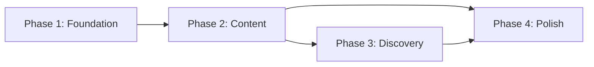

# Documentation Roadmap

Master plan for implementing first-class documentation for the HyperFrontend framework.

---

## Overview

This roadmap transforms HyperFrontend's documentation from a placeholder Hugo site into a production-grade, automated documentation system. Implementation is organized into four sequential phases, each delivering incremental value while building toward the complete vision outlined in the [Documentation Strategy](./documentation-strategy.md).

### Guiding Principles

- **Incremental delivery** — Each phase produces a functional, improved state
- **Automation first** — Invest in tooling early to reduce ongoing maintenance
- **User value** — Prioritize features that directly improve developer experience
- **Quality over speed** — Better to ship one phase well than rush multiple phases

---

## Phase Overview

| Phase                                                        | Focus               | Outcome                                                        |
| ------------------------------------------------------------ | ------------------- | -------------------------------------------------------------- |
| [Phase 1: Foundation](./documentation-phase-1-foundation.md) | Infrastructure      | Next.js site live on Vercel with basic content                 |
| [Phase 2: Content](./documentation-phase-2-content.md)       | API Documentation   | All libraries documented with TypeDoc; README content migrated |
| [Phase 3: Discovery](./documentation-phase-3-discovery.md)   | Search & Versioning | Algolia search working; versioned documentation system         |
| [Phase 4: Polish](./documentation-phase-4-polish.md)         | UX & Engagement     | Monaco views, branding, voting, full mobile experience         |

---

## Phase 1: Foundation

**Goal:** Establish the technical foundation and migrate existing content.

**Key Deliverables:**

- Next.js project configured with Tailwind CSS
- Deployed to Vercel at [hyperfrontend.dev](https://www.hyperfrontend.dev)
- Basic navigation structure mirroring monorepo
- Landing page with project overview
- Getting Started guide migrated from README
- Basic dark/light theme support

**Success Criteria:**

- Site loads in < 2 seconds
- Navigation covers all 14+ projects
- Mobile-responsive layout
- CI/CD pipeline deploys on push to main

**Details:** [Phase 1 Action Plan](./documentation-phase-1-foundation.md)

---

## Phase 2: Content

**Goal:** Populate the site with comprehensive API documentation and project content.

**Key Deliverables:**

- TypeDoc integration for all library projects
- Automated API reference generation per release
- README.md content extraction and rendering
- ARCHITECTURE.md content integration
- Mermaid diagram rendering
- Link transformation (GitHub → docs site)
- Contributing section from CONTRIBUTING.md

**Success Criteria:**

- 100% of public APIs documented
- All project READMEs rendered on site
- Mermaid diagrams render correctly
- Internal links resolve to docs site URLs
- Build completes in < 5 minutes

**Details:** [Phase 2 Action Plan](./documentation-phase-2-content.md)

---

## Phase 3: Discovery

**Goal:** Make content findable through search, versioning, and SEO optimization.

**Key Deliverables:**

- Algolia DocSearch integration
- Version selector UI component
- Versioned URL structure (`/v1.2.3/...`)
- Version build pipeline (generate docs from Git tags)
- SEO meta tags and Open Graph data
- Sitemap generation
- Structured data for search engines

**Success Criteria:**

- Users find content within 1 search
- Version switching works from any page
- Last 10 major versions accessible
- Google indexes all pages within 30 days
- Core Web Vitals pass

**Details:** [Phase 3 Action Plan](./documentation-phase-3-discovery.md)

---

## Phase 4: Polish

**Goal:** Elevate the user experience with interactive features and engagement tools.

**Key Deliverables:**

- Monaco editor for code examples (read-only)
- Copy-to-clipboard for all code blocks
- Branding assets (SVG logo, favicon, social cards)
- Logo animation and loading states
- "Report issue" → GitHub integration
- Usefulness voting (IP-based)
- Social sharing buttons
- RSS feed for releases
- Demo showcase section

**Success Criteria:**

- Code copying works everywhere
- Branding consistent across site
- Issue reporting creates GitHub issues
- Social sharing generates rich previews
- Demo links functional

**Details:** [Phase 4 Action Plan](./documentation-phase-4-polish.md)

---

## Dependencies

- **Phase 2** requires Phase 1 (site must exist to add content)
- **Phase 3** requires Phase 2 (search needs content to index)
- **Phase 4** can partially overlap with Phase 3 (branding work is independent)

---

## Technology Decisions

Decisions made in the [Documentation Strategy](./documentation-strategy.md#resolved-decisions):

| Area        | Decision                                                    |
| ----------- | ----------------------------------------------------------- |
| Framework   | [Next.js](https://nextjs.org/)                              |
| Hosting     | [Vercel](https://vercel.com/)                               |
| Styling     | [Tailwind CSS](https://tailwindcss.com/)                    |
| Search      | [Algolia DocSearch](https://docsearch.algolia.com/)         |
| API Docs    | [TypeDoc](https://typedoc.org/)                             |
| Code Views  | [Monaco Editor](https://microsoft.github.io/monaco-editor/) |
| Analytics   | [Vercel Analytics](https://vercel.com/analytics)            |
| Design Base | `syntax` + `primer` templates (reimagined)                  |

---

## Risk Mitigation

| Risk                               | Mitigation                                                  |
| ---------------------------------- | ----------------------------------------------------------- |
| TypeDoc output doesn't match needs | Start with minimal config; iterate based on actual output   |
| Algolia free tier limits           | Monitor usage; DocSearch is generous for open-source        |
| Version storage costs grow         | Keep 10 versions active; archive older to GitHub Releases   |
| Template copyright concerns        | Reimagine designs rather than copy; document transformation |
| Build times increase               | Leverage Nx caching; parallelize TypeDoc runs               |

---

## Related Documentation

- [Documentation Strategy](./documentation-strategy.md) — Vision and requirements
- [ARCHITECTURE.md](../ARCHITECTURE.md) — Monorepo architecture
- [CONTRIBUTING.md](../CONTRIBUTING.md) — Contribution guidelines
- [documentation-enrichment-plan.md](../_/documentation-enrichment-plan.md) — README enrichment

---

_This roadmap is a living document. Phase details may evolve as implementation progresses and learnings emerge._
