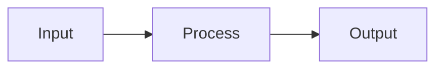

# no-ascii-art-diagrams

Disallow ASCII art diagrams in markdown files; prefer Mermaid diagrams.

## Rule Details

This rule detects ASCII art diagrams (boxes, flowcharts, pipelines) in markdown files. ASCII art diagrams create maintenance burden, accessibility issues, and render poorly across different viewing contexts.

The rule applies different messages based on the file:

- **README.md**: Suggests linking to `ARCHITECTURE.md` or other documentation files since npm does not render Mermaid diagrams
- **Other .md files**: Recommends using Mermaid diagrams for better rendering, accessibility, and maintainability

### Detection Criteria

The rule detects ASCII art inside code blocks that:

1. Contains box-drawing characters (`┌ ┐ └ ┘ │ ─ ├ ┤ ┬ ┴ ┼` and double-line variants)
2. Forms a box structure (corners + vertical borders)
3. Spans at least 3 lines

The rule does **not** flag:

- Directory tree structures (`├── └──`)
- Markdown tables
- Simple code examples

## Examples

### ❌ Incorrect

````markdown
## Pipeline

```
┌─────────────────────────────────────────────────────────────┐
│                         PIPELINE                            │
├─────────────────────────────────────────────────────────────┤
│   Input ──▶ │ Process │ ──▶ │ Output │                     │
└─────────────────────────────────────────────────────────────┘
```
````

### ✅ Correct (in ARCHITECTURE.md or other docs)

````markdown
## Pipeline


````

### ✅ Correct (in README.md)

```markdown
## Architecture

See [ARCHITECTURE.md](./ARCHITECTURE.md) for detailed diagrams and system design documentation.
```

### ✅ Allowed (directory trees)

````markdown
## Project Structure

```
src/
├── index.ts
├── utils/
│   └── helper.ts
└── types.ts
```
````

## When Not To Use It

If your documentation targets environments that cannot render Mermaid diagrams and you need inline visualizations, you may disable this rule for specific files.

## Options

This rule has no options.

## Scope

This rule applies to all markdown files (`.md` extension).

## Related

- [Mermaid Documentation](https://mermaid.js.org/)
- [lib-readme-structure](./lib-readme-structure.md) - README structure requirements
