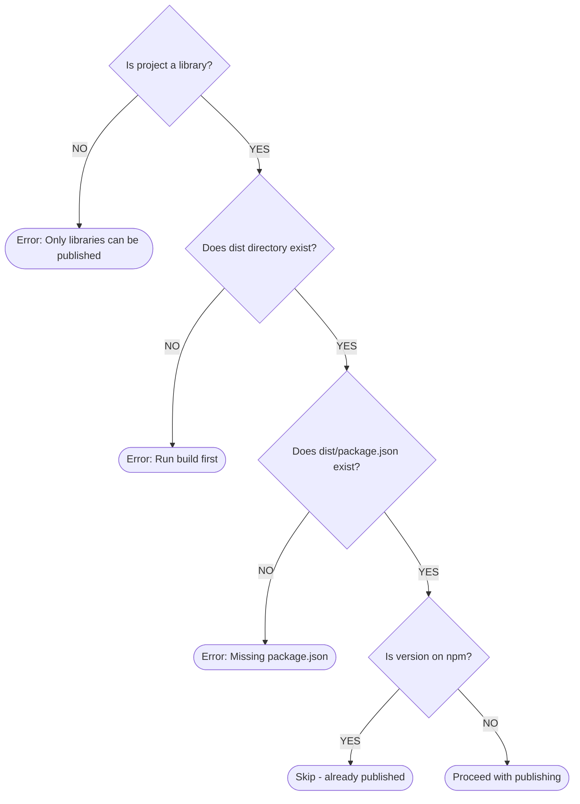
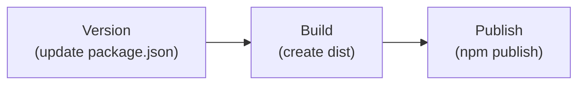

# Publish Executor

Idempotent npm publishing for hyperfrontend monorepo packages.

> **Related Documentation:**
>
> - [Version Executor](../version/README.md) - Version management
> - [Build Executor](../build/README.md) - Build packages before publishing
> - [Plugin README](../../../README.md) - Plugin overview

## Overview

The `@hyperfrontend/package:publish` executor publishes built library packages to the npm registry with safety checks and dry-run support.

**Key features:**

- Idempotent - skips if version already exists on npm
- Dry-run mode for testing
- Automatic access control for scoped packages
- 2FA OTP support

---

## Quick Start

```bash
# Publish a single library
npx nx publish lib-cryptography

# Preview what would be published
npx nx publish lib-cryptography --dryRun

# Publish all affected libraries
npx nx affected -t publish --base=main
```

---

## Usage Examples

### Basic Publishing

```bash
# Publish to npm
npx nx publish lib-cryptography

# Publish with a specific tag
npx nx publish lib-cryptography --tag=beta

# Publish with restricted access (private package)
npx nx publish lib-cryptography --access=restricted
```

### Dry Run

```bash
# See what would be published without actually publishing
npx nx publish lib-cryptography --dryRun
```

Output shows:

- Package name and version
- Dist path
- Tag and access settings
- npm publish command that would run

### Custom Registry

```bash
# Publish to a private registry
npx nx publish lib-cryptography --registry=https://registry.mycompany.com
```

### With 2FA

```bash
# Publish with one-time password
npx nx publish lib-cryptography --otp=123456
```

---

## Configuration Options

All options can be passed via CLI flags or configured in `project.json`:

| Option     | Type    | Default    | Description                                   |
| ---------- | ------- | ---------- | --------------------------------------------- |
| `dryRun`   | boolean | `false`    | Preview publish without actually publishing   |
| `registry` | string  | npm config | Custom npm registry URL                       |
| `tag`      | string  | `latest`   | npm dist-tag (e.g., `latest`, `next`, `beta`) |
| `access`   | string  | `public`   | Access level: `public` or `restricted`        |
| `otp`      | string  | -          | One-time password for npm 2FA                 |

---

## How It Works

### 1. Validation

Before publishing, the executor validates:



### 2. Idempotency Check

The executor checks npm to see if the version already exists:

```bash
npm view @hyperfrontend/cryptography@1.2.0 version
```

If the version exists, publishing is skipped with a success status. This makes re-running CI safe.

### 3. Publish

Runs `npm publish` in the dist directory with configured options.

---

## Project Configuration

Add to `project.json`:

```json
{
  "targets": {
    "publish": {
      "executor": "@hyperfrontend/package:publish",
      "options": {
        "access": "public",
        "tag": "latest"
      },
      "dependsOn": ["build"]
    }
  }
}
```

---

## Environment Variables

| Variable    | Description                                |
| ----------- | ------------------------------------------ |
| `NPM_TOKEN` | npm authentication token for CI publishing |

In CI, set this as a secret:

```yaml
- name: Publish
  env:
    NPM_TOKEN: ${{ secrets.NPM_TOKEN }}
  run: npx nx publish lib-cryptography
```

---

## CI Integration

The publish executor is designed for CI workflows:



### Typical CI Job

```yaml
publish:
  runs-on: ubuntu-latest
  steps:
    - uses: actions/checkout@v4
    - uses: actions/setup-node@v4
      with:
        node-version: 24
        registry-url: 'https://registry.npmjs.org'

    - run: npm ci
    - run: npx nx build lib-cryptography
    - run: npx nx publish lib-cryptography
      env:
        NODE_AUTH_TOKEN: ${{ secrets.NPM_TOKEN }}
```

---

## Troubleshooting

### "Dist directory not found"

**Cause:** Package hasn't been built yet.

**Solution:** Run `npx nx build <project>` first, or add `dependsOn: ["build"]` to the publish target.

### "package.json not found in dist"

**Cause:** Build didn't include package.json in output.

**Solution:** Check build executor configuration.

### "Project is not a library"

**Cause:** Trying to publish an application instead of a library.

**Solution:** Only library projects (`projectType: "library"`) can be published.

### "Already published to npm, skipping"

**Cause:** Version already exists on npm registry.

**Solution:** This is expected idempotent behavior. Bump the version first if you need to publish a new version.

---

## Related Files

| File                         | Purpose                      |
| ---------------------------- | ---------------------------- |
| [executor.ts](./executor.ts) | Main executor implementation |
| [schema.json](./schema.json) | Options JSON Schema          |
| [schema.d.ts](./schema.d.ts) | TypeScript types             |

---

## Related Executors

| Executor                            | Description              |
| ----------------------------------- | ------------------------ |
| [version](../version/README.md)     | Version management       |
| [build](../build/README.md)         | Build library packages   |
| [typecheck](../typecheck/README.md) | TypeScript type checking |

---

## See Also

- [npm publish](https://docs.npmjs.com/cli/v10/commands/npm-publish) - npm publish documentation
- [npm dist-tags](https://docs.npmjs.com/cli/v10/commands/npm-dist-tag) - Managing distribution tags
