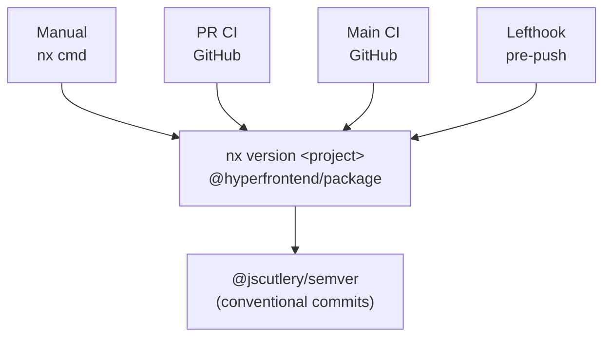
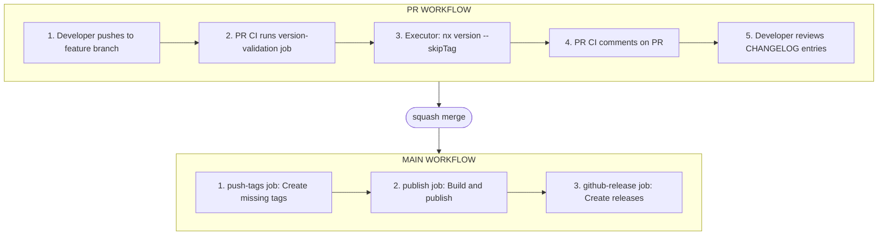
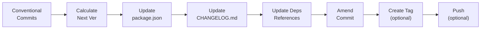
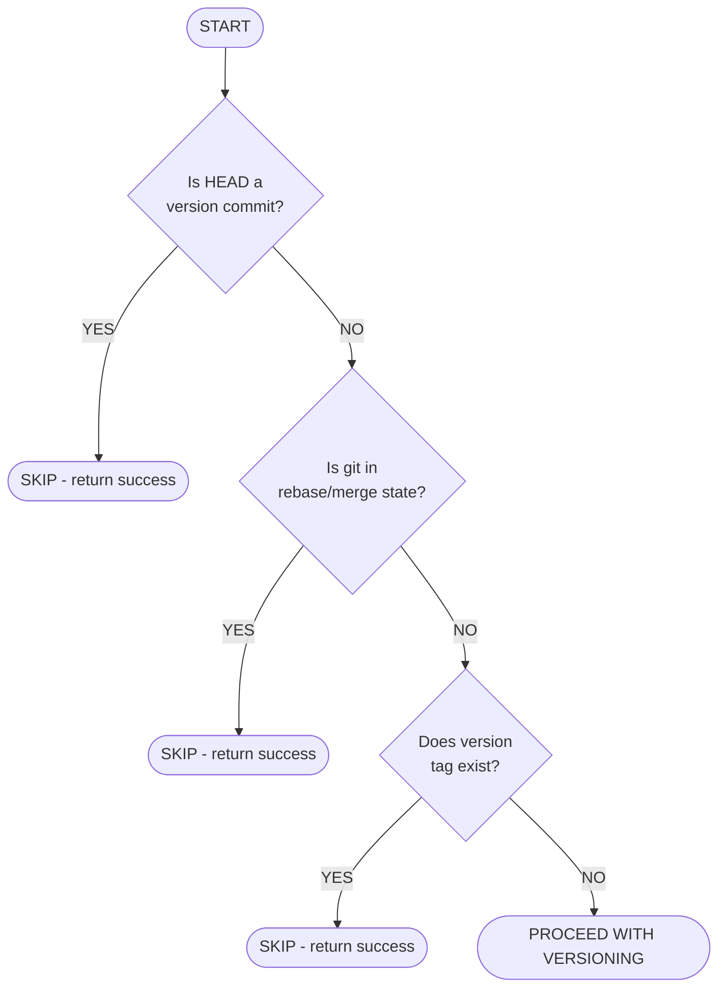

# Version Executor Architecture

High-level design overview of the `@hyperfrontend/package:version` executor.

## Design Philosophy

The version executor is designed as the **single source of truth** for all versioning behavior in the monorepo. It encapsulates all versioning logic, safety checks, and integrations so that every trigger point (manual, CI, hooks) can use the same codebase with consistent behavior.

### Core Principles

1. **Idempotent** - Running the executor multiple times produces the same result
2. **Recursion-proof** - Automatically detects and skips version commits
3. **Context-aware** - Adapts to git state (rebase, merge, CI environment)
4. **Self-sufficient** - Performs all fact-finding internally

---

## System Architecture

```mermaid
flowchart TB
    subgraph executor["VERSION EXECUTOR (Single Source of Truth)"]
        subgraph inputs["INPUTS"]
            i1["projectName (required, from Nx context)"]
            i2["dryRun, skipCommit, skipTag, push, etc. (optional)"]
        end

        subgraph factfinding["INTERNAL FACT-FINDING (in order)"]
            f1["1. Is current commit a version commit? → Skip"]
            f2["2. Is git in rebase/merge state? → Skip"]
            f3["3. Does version tag already exist? → Skip"]
        end

        subgraph versioning["VERSIONING (delegates to @jscutlery/semver)"]
            v1["Analyze conventional commits since last tag"]
            v2["Calculate next semantic version"]
            v3["Update package.json version"]
            v4["Generate CHANGELOG.md entry"]
            v5["Create git commit (unless skipCommit)"]
            v6["Create git tag (unless skipTag)"]
        end

        subgraph post["POST-VERSIONING"]
            p1["Update dependent packages' version refs"]
            p2["Amend commit to include dependency updates"]
            p3["Push to remote (if push=true)"]
        end

        inputs --> factfinding --> versioning --> post
    end
```



---

## Component Interactions

### Trigger Points

All versioning triggers use the same executor, ensuring consistent behavior:



### CI Pipeline Integration



---

## Data Flow

### Version Bump Flow



### Idempotency Check Order

The executor performs checks in a specific order for optimal performance:



---

## Design Decisions

### Why Wrap @jscutlery/semver?

The `@jscutlery/semver` package provides excellent conventional commit analysis and changelog generation but lacks:

1. **Idempotency** - Re-running always attempts version bump
2. **Recursion prevention** - Can trigger infinite loops in hooks
3. **Git state awareness** - Doesn't handle rebase/merge edge cases
4. **Dependent updates** - Doesn't update cross-package references

Our wrapper adds these capabilities while delegating core versioning logic.

### Why Skip Tags in PR CI?

When a PR is **squash merged**, all commits on the branch (including version commits) are combined into a single merge commit. Tags created on the original version commit would point to a commit that no longer exists in the main branch history (an "orphaned tag").

**Solution**: PR CI creates version bumps without tags (`--skipTag`). Main CI creates tags after merge, pointing at the actual merge commit.

### Why Commit Message Detection?

Tag existence checks fail when `--skipTag` is used. Commit message detection provides a secondary idempotency mechanism:

```typescript
const VERSION_COMMIT_PATTERNS = [
  /^chore\([^)]+\): release version/, // Manual versioning
  /^chore: update versions for/, // PR CI versioning
  /^chore\(release\):/, // Alternative format
]
```

### Why Update Dependent Package References?

In a monorepo, packages often depend on each other. When `lib-cryptography` bumps to `1.2.0`, any package with `"@hyperfrontend/cryptography": "1.1.0"` in its dependencies should update to `"1.2.0"`.

The executor:

1. Finds all `package.json` files in `libs/`
2. Updates references to the versioned package
3. Includes changes in the version commit (via amend)

---

## File Structure

```
tools/package/src/executors/version/
├── ARCHITECTURE.md      # This file - system design overview
├── README.md            # Usage guide, options, examples
├── executor.ts          # Main executor implementation
├── schema.json          # JSON Schema for options validation
└── schema.d.ts          # TypeScript type definitions
```

---

## Related Documentation

- [README.md](./README.md) - Usage guide with examples
- [VERSIONING_ACTION_PLAN.md](../../../../../roadmap/VERSIONING_ACTION_PLAN.md) - Implementation plan
- [VERSIONING_STRATEGY.md](../../../../../roadmap/VERSIONING_STRATEGY.md) - Strategy overview
