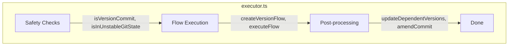
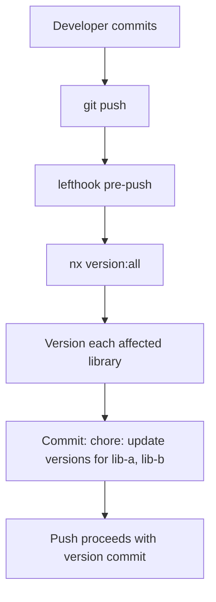
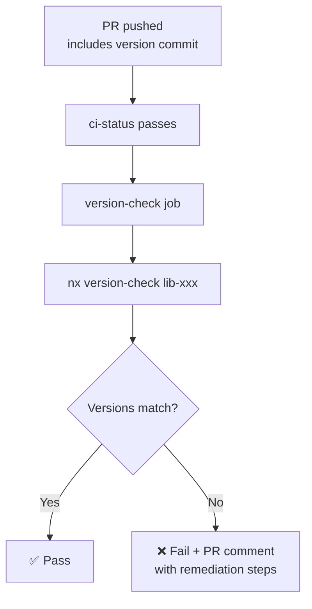
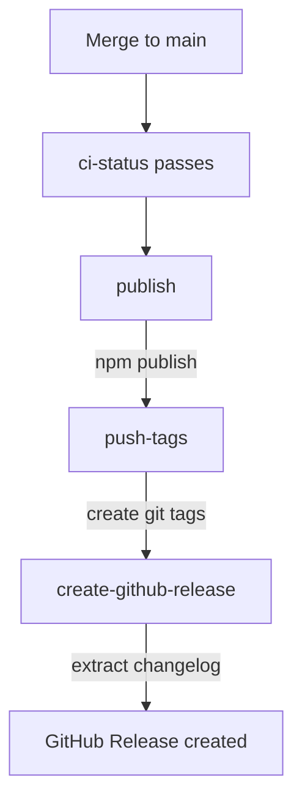

# Version Executor Architecture

This document describes the design and architecture of the version executor.

## Overview

The version executor uses `@hyperfrontend/versioning` to implement conventional commits-based versioning with npm registry as the source of truth.



## Design Principles

### 1. npm as Source of Truth

The executor uses the npm registry (not git tags) to determine the current published version. This enables:

- **No tag fetch required** — CI workflows don't need `git fetch --tags`
- **Idempotent versioning** — Safe to re-run; skips if version already on npm
- **Tag as output** — Tags are created after publish, not during version

### 2. Zero External Dependencies

The `@hyperfrontend/versioning` library has no transitive dependencies. It uses:

- Node.js built-ins (`child_process`, `fs`, `path`)
- Internal hyperfrontend libraries (`@hyperfrontend/project-scope`)

### 3. Conventional Commits

Version bumps are determined by analyzing commit messages:

```
feat(lib): add new feature    → MINOR bump
fix(lib): fix a bug           → PATCH bump
docs(lib): update readme      → MINOR bump (project-specific)
BREAKING CHANGE: remove API   → MAJOR bump
```

## Component Details

### Safety Checks

Before running the version flow, the executor performs safety checks:

```typescript
// Skip if current commit is a version commit for this project
if (isVersionCommit(workspaceRoot, projectName)) {
  return { success: true }
}

// Skip if git is in rebase/merge state
if (isInUnstableGitState(workspaceRoot)) {
  return { success: true }
}
```

**Why project-specific version commit detection?**

In a monorepo, multiple libraries may be versioned in sequence. If Library A creates a version commit, we still want Library B to version (since A's commit isn't B's version commit). The check parses the commit message to extract the project name.

### Flow Execution

The executor delegates to `@hyperfrontend/versioning`'s conventional flow:

```typescript
const flow = createVersionFlow('conventional', {
  dryRun: options.dryRun,
  skipGit: options.skipCommit,
  skipTag: options.skipTag ?? true,
  tagFormat: `${tagPrefix}\${version}`,
})

const result = await executeFlow(flow, projectName, workspaceRoot, {
  dryRun: options.dryRun,
  verbose: options.verbose,
})
```

The flow executes these steps:

| Step               | Action                           | State Updates                        |
| ------------------ | -------------------------------- | ------------------------------------ |
| fetch-registry     | `npm view` for published version | `publishedVersion`, `currentVersion` |
| analyze-commits    | Parse commits since last release | `commits`, `effectiveBaseCommit`     |
| calculate-bump     | Determine major/minor/patch      | `bumpType`, `nextVersion`            |
| check-idempotency  | Skip if `nextVersion` on npm     | Sets `bumpType: 'none'` if published |
| generate-changelog | Build entry from commits         | `changelogEntry`                     |
| update-packages    | Update package.json version      | `modifiedFiles`                      |
| write-changelog    | Update CHANGELOG.md              | `modifiedFiles`                      |
| create-commit      | Stage + commit                   | `commitHash`                         |
| create-tag         | Create tag (if not skipped)      | `tagName`                            |

### Post-processing

After the flow completes, the executor handles dependent updates:

```typescript
// Update packages that depend on this one
const updatedFiles = updateDependentVersions(packageName, newVersion, ...)

// Update E2E test packages
const e2eUpdatedFiles = updateE2eDependencies(packageName, newVersion, ...)

// Amend the version commit to include these changes
if (updatedFiles.length > 0 && !options.skipCommit) {
  execSync('git add ...')
  execSync('git commit --amend --no-edit')
}
```

## CI Integration

### Local Versioning (lefthook)

Version bumps happen **locally** via lefthook pre-push hooks, not in CI:



The `version-batch` executor:

- Detects affected libraries programmatically using Nx project graph
- Runs versioning for each affected library
- Creates a single batch commit for all changes
- Handles rollback on failure

### PR Workflow (validation-only)

CI validates that version bumps were correctly applied using the **version-check** executor:



The version-check executor:

- Runs version flow in **dry-run mode** to calculate expected state
- Compares expected version/changelog against actual files on disk
- Returns pass/fail with detailed discrepancy information
- Does NOT make any changes (read-only)

If a developer bypasses lefthook (`--no-verify`), CI will fail with clear instructions to fix.

See [version-check executor](../version-check/) for implementation details.

### Main Workflow



Tags are created **after** publish because:

1. Version calculation uses npm registry (no tags needed)
2. Tags serve as a record of what's published, not a source of truth
3. Avoids tag manipulation if publish fails

## Version-Check Executor

The `version-check` executor shares validation logic with the version executor:

```
tools/package/src/executors/
├── version/
│   ├── executor.ts
│   └── lib/
│       └── validate-version-state.ts  ← Shared validation logic
└── version-check/
    ├── executor.ts                    ← Imports shared logic
    └── schema.json
```

### Validation Flow

```typescript
async function validateVersionState(options) {
  // 1. Run version flow in dry-run mode
  const flow = createVersionFlow('conventional', { dryRun: true })
  const result = await executeFlow(flow, projectName, workspaceRoot, { dryRun: true })

  // 2. Read actual state from disk
  const actualVersion = readPackageJson().version
  const actualChangelog = parseChangelog(readFile('CHANGELOG.md'))

  // 3. Compare expected vs actual
  if (actualVersion !== result.state.nextVersion) {
    return { status: 'invalid', discrepancies: [...] }
  }

  // 4. Validate changelog entry exists and matches
  if (!hasVersion(actualChangelog, result.state.nextVersion)) {
    return { status: 'invalid', discrepancies: [...] }
  }

  return { status: 'valid' }
}
```

## Error Handling

The executor returns `{ success: false }` when:

- Project not found in project graph
- Flow execution fails (status != 'success' or 'skipped')

The executor returns `{ success: true }` (skip scenarios):

- Current commit is a version commit for this project
- Git is in rebase/merge state
- Flow reports no release needed or already published

## See Also

- [README.md](./README.md) — Usage and options
- [version-check executor](../version-check/) — Validation-only executor for CI
- [@hyperfrontend/versioning](../../../../libs/versioning) — Underlying versioning library
- [lefthook.yml](../../../../../lefthook.yml) — Git hooks configuration
