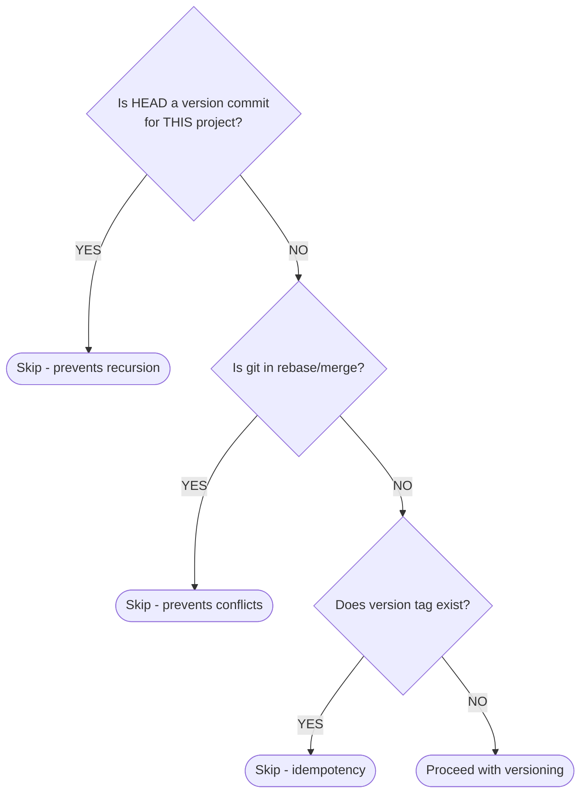

# Version Executor

Idempotent version management for hyperfrontend monorepo packages.

> **Related Documentation:**
>
> - [ARCHITECTURE.md](./ARCHITECTURE.md) - System design overview
> - [Publish Executor](../publish/README.md) - npm publish executor
> - [Plugin README](../../../README.md) - Plugin overview

## Overview

The `@hyperfrontend/package:version` executor wraps `@jscutlery/semver:version` with additional safety checks and automation. It analyzes conventional commits to determine semantic version bumps and generates changelogs.

**Key features:**

- Idempotent - safe to run multiple times
- Recursion-proof - won't re-version on version commits (project-specific)
- Documentation commits (`docs`) trigger MINOR bumps
- Auto-updates dependent package references
- Works in CI and locally

---

## Quick Start

```bash
# Version a single library
npx nx version lib-cryptography

# Preview changes without committing
npx nx version lib-cryptography --dryRun

# Version all affected libraries
npx nx affected -t version --base=main
```

---

## Usage Examples

### Manual Versioning

```bash
# Let conventional commits determine version bump
npx nx version lib-cryptography

# Force a specific version bump
npx nx version lib-cryptography --releaseAs=minor
npx nx version lib-cryptography --releaseAs=major
npx nx version lib-cryptography --releaseAs=patch

# Create a prerelease
npx nx version lib-cryptography --releaseAs=prerelease --preid=beta
# Results in: 1.0.0 → 1.0.1-beta.0
```

### CI Versioning

```bash
# Skip tag creation (for PR branches - tags created on main)
npx nx version lib-cryptography --skipTag

# Skip commit (manual control over commits)
npx nx version lib-cryptography --skipCommit --skipTag

# Version and push in one step
npx nx version lib-cryptography --push
```

### Dry Run

```bash
# See what would happen without making changes
npx nx version lib-cryptography --dryRun
```

Output shows:

- Calculated version bump
- Commits that would be analyzed
- Changelog entry preview
- Dependent packages that would be updated

---

## Configuration Options

All options can be passed via CLI flags or configured in `project.json`:

### Core Options

| Option      | Type    | Default      | Description                                                 |
| ----------- | ------- | ------------ | ----------------------------------------------------------- |
| `dryRun`    | boolean | `false`      | Preview changes without committing                          |
| `releaseAs` | string  | auto         | Force version bump: `major`, `minor`, `patch`, `prerelease` |
| `preid`     | string  | -            | Prerelease identifier (e.g., `beta`, `alpha`, `rc`)         |
| `tagPrefix` | string  | `{project}@` | Tag prefix (e.g., `lib-cryptography@1.0.0`)                 |

### Git Options

| Option       | Type    | Default  | Description                    |
| ------------ | ------- | -------- | ------------------------------ |
| `skipCommit` | boolean | `false`  | Don't create a git commit      |
| `skipTag`    | boolean | `false`  | Don't create a git tag         |
| `push`       | boolean | `false`  | Push commit and tags to remote |
| `remote`     | string  | `origin` | Git remote to push to          |
| `baseBranch` | string  | `main`   | Base branch for comparison     |
| `noVerify`   | boolean | `false`  | Skip git hooks during commit   |

### Safety Options

| Option                | Type    | Default | Description                                             |
| --------------------- | ------- | ------- | ------------------------------------------------------- |
| `skipIfVersionCommit` | boolean | `true`  | Skip if HEAD is a version commit (recursion prevention) |
| `skipIfUnstableGit`   | boolean | `true`  | Skip if git is in rebase/merge state                    |
| `allowEmptyRelease`   | boolean | `false` | Allow version bump even without changes                 |
| `updateDependents`    | boolean | `true`  | Update version refs in dependent packages               |

### Changelog Options

| Option                | Type             | Default | Description                                   |
| --------------------- | ---------------- | ------- | --------------------------------------------- |
| `preset`              | string \| object | custom  | Conventional commits preset (see below)       |
| `changelogHeader`     | string           | -       | Custom changelog header                       |
| `commitMessageFormat` | string           | -       | Custom commit message format                  |
| `skipCommitTypes`     | string[]         | `[]`    | Commit types to ignore in version calculation |

> **Note:** The default preset is a custom `conventionalcommits` configuration that includes `docs` commits for version bumps. See [Commit Types](#commit-types-and-version-impact) below.

### Advanced Options

| Option        | Type     | Default | Description                                       |
| ------------- | -------- | ------- | ------------------------------------------------- |
| `trackDeps`   | boolean  | `false` | Include dependency changes in version calculation |
| `postTargets` | string[] | `[]`    | Nx targets to run after versioning                |

---

## How It Works

### 1. Early Exit Checks

Before versioning, the executor checks:



> **Note:** The version commit check is project-specific. Versioning `lib-a` won't block `lib-b` from being versioned.

### 2. Version Calculation (Commit Types and Version Impact)

This executor uses a custom preset that includes documentation commits for version bumps:

| Commit Type               | Version Bump  | Changelog Section        |
| ------------------------- | ------------- | ------------------------ |
| `feat:`                   | Minor (0.X.0) | Features                 |
| `docs:`                   | Minor (0.X.0) | Documentation            |
| `fix:`                    | Patch (0.0.X) | Bug Fixes                |
| `perf:`                   | Patch (0.0.X) | Performance Improvements |
| `build:`                  | Patch (0.0.X) | Build System             |
| `BREAKING CHANGE:` or `!` | Major (X.0.0) | -                        |
| `refactor:`               | None          | (hidden)                 |
| `style:`                  | None          | (hidden)                 |
| `test:`                   | None          | (hidden)                 |
| `ci:`                     | None          | (hidden)                 |
| `chore:`                  | None          | (hidden)                 |

> **Philosophy:** Documentation updates are considered meaningful user-facing changes and trigger MINOR version bumps.

### 3. Artifacts Created

- **package.json** - Updated version field
- **CHANGELOG.md** - New entry prepended
- **Git commit** - With conventional message
- **Git tag** - `{project}@{version}` format

### 4. Dependent Updates

After versioning `lib-cryptography` to `1.2.0`:

```json
// libs/network-protocol/package.json (before)
{
  "dependencies": {
    "@hyperfrontend/cryptography": "1.1.0"
  }
}

// libs/network-protocol/package.json (after)
{
  "dependencies": {
    "@hyperfrontend/cryptography": "1.2.0"
  }
}
```

Changes are included in the version commit via amend.

---

## Commit Message Patterns

The executor recognizes these patterns as version commits (for recursion prevention):

```
chore(lib-cryptography): release version 1.2.0   # Manual versioning
chore: update versions for lib-cryptography      # PR CI versioning
chore: update versions for lib-a, lib-b          # Multi-package CI versioning
chore(release): lib-cryptography 1.0.0           # Alternative format
```

**Important:** This check is **project-specific**. If `lib-a` was just versioned, `lib-b` can still be versioned even though the last commit was a version commit for `lib-a`. This prevents one library's version commit from blocking other libraries.

---

## Troubleshooting

### "Tag already exists (skipping)"

**Cause:** Version tag exists, executor is being idempotent.

**Solutions:**

- This is expected behavior on re-runs
- Use `--releaseAs` to force a new version
- Use `--allowEmptyRelease` to force bump

### "Skipping - current commit is a version/release commit for this project"

**Cause:** HEAD is a version commit for the same project you're trying to version.

**Solutions:**

- This prevents infinite recursion - usually correct behavior
- Make a new commit before versioning
- Use `--skipIfVersionCommit=false` to override (use carefully)

> **Note:** This check is project-specific. If `lib-a` was versioned, you can still version `lib-b`.

### "Skipping - git is in rebase/merge state"

**Cause:** Git state files detected (`.git/rebase-merge`, etc.)

**Solutions:**

- Complete or abort the rebase/merge first
- Run versioning after git state is clean

### No version bump detected

**Cause:** No conventional commits since last tag.

**Solutions:**

- Check commit messages follow conventional format
- Verify tags exist: `git tag | grep <project>`
- Use `--releaseAs=patch` to force a bump
- Use `--allowEmptyRelease` for empty release

### Dependent packages not updated

**Cause:** `updateDependents` disabled or no cross-references.

**Solutions:**

- Verify `--updateDependents` is not set to false
- Check package names in dependencies match exactly

---

## Project Configuration

Add to `project.json` for default options:

```json
{
  "targets": {
    "version": {
      "executor": "@hyperfrontend/package:version",
      "options": {
        "preset": "angular",
        "updateDependents": true,
        "baseBranch": "main"
      }
    }
  }
}
```

---

## Testing the Executor

```bash
# Test with dry run
npx nx version lib-cryptography --dryRun

# Test idempotency (second run should skip)
npx nx version lib-cryptography
npx nx version lib-cryptography  # Should say "Tag already exists"

# Test recursion prevention
# After a version commit, running again should skip
npx nx version lib-cryptography  # Should say "Skipping - version commit"
```

---

## Related Files

| File                                 | Purpose                      |
| ------------------------------------ | ---------------------------- |
| [executor.ts](./executor.ts)         | Main executor implementation |
| [schema.json](./schema.json)         | Options JSON Schema          |
| [schema.d.ts](./schema.d.ts)         | TypeScript types             |
| [ARCHITECTURE.md](./ARCHITECTURE.md) | System design overview       |

---

## Related Executors

| Executor                            | Description              |
| ----------------------------------- | ------------------------ |
| [publish](../publish/README.md)     | Publish to npm           |
| [build](../build/README.md)         | Build library packages   |
| [typecheck](../typecheck/README.md) | TypeScript type checking |

---

## See Also

- [@jscutlery/semver](https://github.com/jscutlery/semver) - Underlying versioning library
- [Conventional Commits](https://www.conventionalcommits.org/) - Commit message format
- [Semantic Versioning](https://semver.org/) - Version numbering specification
